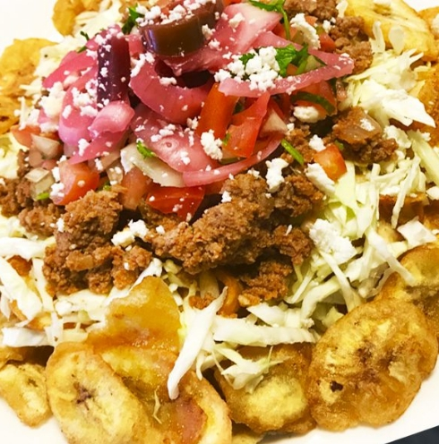

# my-summer-in-markdown

## 1. Favorite food this summer

<u>My favorite summer food tajadas my mom found a place that delivers them and it is my new favorite food, I highly recommend them they are fried bananas like plantains but they are usually cut very thin but still thicker than chips and its good however you order them, but with the sauce and meat or chicken it is my favorite food.</u>

## 2. Summer activities

<u>During this summer I played multiple video games like Terreria and CS2. I also hung out a lot with my family and little sister who is only a few months old, we watched TV or played games together.</u>

## 3. Goals

<u>My goals are to get all A's in all my class or at least B's and not to slack off like last year</u>

## 4. Expectations

<u> I expect to use my knowledge from last year and build on it to increase my skill</u>

## 5. Most memorable experience 

<u>I loved playing Terreria but surprisingly that was not the highlight, my best memory is being with my baby sister and smiling with her while she tries to touch my hair</u>

